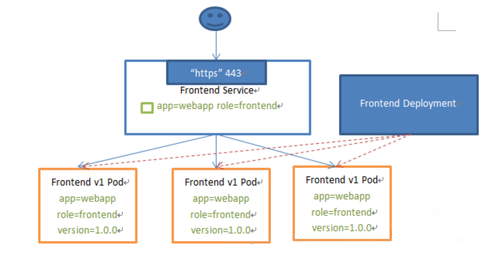
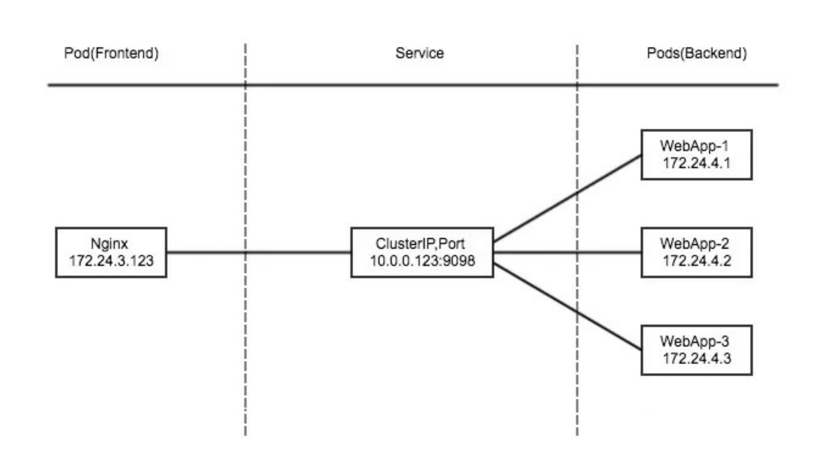
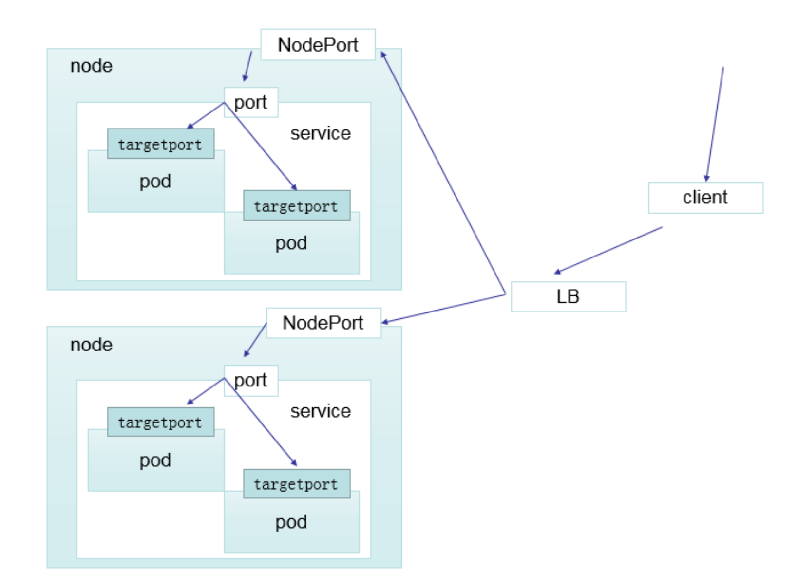

# Kubernetes Service

### **Service** 的概念

Kubernetes  `Service` 定义了这样一种抽象：一个 `Pod` 的逻辑分组，一种可以访问它们的策略 —— 通常称为微
服务。 这一组 `Pod` 能够被 `Service` 访问到，通常是通过 `Label Selector`



##### Service能够提供负载均衡的能力，但是在使用上有以下限制：

- 只提供 4 层负载均衡能力，而没有 7 层功能，但有时我们可能需要更多的匹配规则来转发请求，这点上 4 层
负载均衡是不支持的


### Service 的类型

##### Service 在 K8s 中有以下四种类型:

- ClusterIp：默认类型，自动分配一个仅 Cluster 内部可以访问的虚拟 IP
- NodePort：在 ClusterIP 基础上为 Service 在每台机器上绑定一个端口，这样就可以通过 : NodePort 来访
  问该服务
- LoadBalancer：在 NodePort 的基础上，借助 cloud provider 创建一个外部负载均衡器，并将请求转发
  到: NodePort
- ExternalName：把集群外部的服务引入到集群内部来，在集群内部直接使用。没有任何类型代理被创建，
  这只有 kubernetes 1.7 或更高版本的 kube-dns 才支持

```shell
$ iptables -t nat -nvL
```


### VIP 和 Service 代理(后续补充)


### 代理模式的分类(后续补充)


### ClusterIP

clusterIP 主要在每个 node 节点使用 iptables，将发向 clusterIP 对应端口的数据，转发到 kube-proxy 中。然
后 kube-proxy 自己内部实现有负载均衡的方法，并可以查询到这个 service 下对应 pod 的地址和端口，进而把
数据转发给对应的 pod 的地址和端口



##### 为了实现图上的功能，主要需要以下几个组件的协同工作：

- apiserver 用户通过kubectl命令向apiserver发送创建service的命令，apiserver接收到请求后将数据存储
到etcd中
- kube-proxy kubernetes的每个节点中都有一个叫做kube-porxy的进程，这个进程负责感知service，pod
的变化，并将变化的信息写入本地的iptables规则中
- iptables 使用NAT等技术将virtualIP的流量转至endpoint中

##### 创建 `myapp-deploy.yaml `文件

```yaml
apiVersion: apps/v1 
kind: Deployment 
metadata:
  name: myapp-deploy
  namespace: default
spec:
  replicas: 3
  selector:
    matchLabels:
      app: myapp
      release: stabel
  template:
    metadata:
      labels:
        app: myapp
        release: stabel
        env: test
    spec:
      containers:
      - name: myapp
        image: wangyanglinux/myapp:v2
        imagePullPolicy: IfNotPresent
        ports:
        - name: http
          containerPort: 80
```

##### 创建 Service 信息` myapp-service.yaml `

```yaml
apiVersion: v1
kind: Service
metadata:
  name: myapp
  namespace: default
spec:
  type: ClusterIP
  selector:
    app: myapp
    release: stabel
  ports:
  - name: http
    port: 80
    targetPort: 80
```


### Headless Service

有时不需要或不想要负载均衡，以及单独的 `Service IP` 。遇到这种情况，可以通过指定` Cluster
IP(spec.clusterIP)` 的值为 “None” 来创建 `Headless Service `。这类 `Service` 并不会分配 `Cluster IP`， `kubeproxy` 不会处理它们，而且平台也不会为它们进行负载均衡和路由

`myapp-svc-headless.yaml `

```yaml
apiVersion: v1
kind: Service
metadata:
  name: myapp-headless
  namespace: default
spec:
  selector:
    app: myapp
  clusterIP: "None"
  ports:
  - port: 80
    targetPort: 80
```

```shell
$ dig -t A myapp-headless.default.svc.cluster.local. @10.96.0.10
```

### NodePort

nodePort 的原理在于在 node 上开了一个端口，将向该端口的流量导入到 kube-proxy，然后由 kube-proxy 进
一步到给对应的 pod

`myapp-service.yaml `

```yaml
apiVersion: v1
kind: Service
metadata:
  name: myapp
  namespace: default
spec:
  type: NodePort
  selector:
    app: myapp
    release: stabel
  ports:
  - name: http
    port: 80
    targetPort: 80
```

**查询流程**

```shell
$ iptables -t nat -nvL KUBE-NODEPORTS
```


### LoadBalancer

`loadBalancer` 和 `nodePort` 其实是同一种方式。区别在于 `loadBalancer` 比 `nodePort` 多了一步，就是可以调用
`cloud provider `去创建 `LB `来向节点导流



##### 何时使用这种方式？

如果你想要直接暴露服务，这就是默认方式。所有通往你指定的端口的流量都会被转发到对应的服务。它没有过滤条件，没有路由等。这意味着你几乎可以发送任何种类的流量到该服务，像 HTTP，TCP，UDP，Websocket，gRPC 或其它任意种类。

这个方式的最大缺点是每一个用 LoadBalancer 暴露的服务都会有它自己的 IP 地址，每个用到的 LoadBalancer 都需要付费，这将是非常昂贵的。


### ExternalName

这种类型的 `Service` 通过返回 `CNAME` 和它的值，可以将服务映射到 `externalName` 字段的内容( 例如：
hub.gerrywen.com )。`ExternalName Service `是 `Service `的特例，它没有 `selector`，也没有定义任何的端口和
`Endpoint`。相反的，对于运行在集群外部的服务，它通过返回该外部服务的别名这种方式来提供服务

```yaml
apiVersion: v1
kind: Service
metadata:
  name: my-service-1
  namespace: default
spec:
  type: ExternalName
  externalName: hub.gerrywen.com
```

当查询主机 my-service.defalut.svc.cluster.local ( SVC_NAME.NAMESPACE.svc.cluster.local )时，集群的
DNS 服务将返回一个值 my.database.example.com 的 CNAME 记录。访问这个服务的工作方式和其他的相
同，唯一不同的是重定向发生在 DNS 层，而且不会进行代理或转发

进入pod测试(curl -H是定义主机名, service需要加上namespace)

```shell
$ curl http://hub.gerrywen.com
```

```shell
$ curl -H "Host:hub.gerrywen.com" http://my-service-1.default
```

从返回结果可以看到，访问my-service-1.default服务与直接访问hub.gerrywen.com一样效果。


