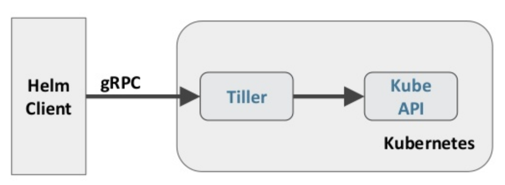

## 什么是Helm

##### 在没使用 helm 之前，向 kubernetes 部署应用，我们要依次部署 deployment、svc 等，步骤较繁琐。况且随着很多项目微服务化，复杂的应用在容器中部署以及管理显得较为复杂，helm 通过打包的方式，支持发布的版本管理和控制，很大程度上简化了 Kubernetes 应用的部署和管理


##### Helm 本质就是让 K8s 的应用管理（Deployment,Service 等 ) 可配置，能动态生成。通过动态生成 K8s 资源清单文件（deployment.yaml，service.yaml）。然后调用 Kubectl 自动执行 K8s 资源部署


##### Helm 是官方提供的类似于 YUM 的包管理器，是部署环境的流程封装。Helm 有两个重要的概念：chart 和 release

 - chart 是创建一个应用的信息集合，包括各种 Kubernetes 对象的配置模板、参数定义、依赖关系、文档说
    明等。chart 是应用部署的自包含逻辑单元。可以将 chart 想象成 apt、yum 中的软件安装包
 - release 是 chart 的运行实例，代表了一个正在运行的应用。当 chart 被安装到 Kubernetes 集群，就生成
    一个 release。chart 能够多次安装到同一个集群，每次安装都是一个 release


##### Helm 包含两个组件：Helm 客户端和 Tiller 服务器，如下图所示




##### Helm 客户端负责 chart 和 release 的创建和管理以及和 Tiller 的交互。Tiller 服务器运行在 Kubernetes 集群中，它会处理 Helm 客户端的请求，与 Kubernetes API Server 交互


## Helm部署

##### 使用 Helm 安装 Kubernetes 的常用 组件。 Helm 由客户端命 helm 令行工具和服务端 tiller 组成，Helm 的安装十分简单。 下载 helm 命令行工具到

##### master 节点 node1 的 /usr/local/bin 下，这里下载的 2.13. 1版本：

```
yum install ntpdate -y
wget https://storage.googleapis.com/kubernetes-helm/helm-v2.13.1-linux-amd64.tar.gz
mv helm-v2.13.1-linux-amd64.tar.gz /root/install-k8s/
cd /root/install-k8s/
tar -zxvf helm-v2.13.1-linux-amd64.tar.gz
cd linux-amd64/ 
cp helm /usr/local/bin/
chmod a+x /usr/local/bin/helm
ln -s /usr/local/bin/helm /usr/bin/helm
```


##### 为了安装服务端 tiller，还需要在这台机器上配置好 kubectl 工具和 kubeconfig 文件，确保 kubectl 工具可以在这台机器上访问 apiserver 且正常使用。 这里的 node1 节点以及配置好了 kubectl

##### 因为 Kubernetes APIServer 开启了 RBAC 访问控制，所以需要创建 tiller 使用的 service account: tiller 并分配合适的角色给它。 详细内容可以查看helm文档中的 [Role-based Access Control](https://helm.sh/docs/intro/)。 这里简单起见直接分配cluster- admin 这个集群内置的 ClusterRole 给它。创建 rbac-config.yaml 文件：

- rbac.yaml

```yaml
apiVersion: v1 
kind: ServiceAccount 
metadata: 
  name: tiller 
  namespace: kube-system 
--- 
apiVersion: rbac.authorization.k8s.io/v1beta1 
kind: ClusterRoleBinding 
metadata: 
  name: tiller 
roleRef: 
  apiGroup: rbac.authorization.k8s.io 
  kind: ClusterRole 
  name: cluster-admin 
subjects: 
  - kind: ServiceAccount 
    name: tiller 
    namespace: kube-system
```

```shell
kubectl create -f rbac.yaml 
```

- ```
  serviceaccount/tiller created
  clusterrolebinding.rbac.authorization.k8s.io/tiller created
  ```

```shell
helm init --service-account tiller --skip-refresh
```

- ```
  Creating /root/.helm 
  Creating /root/.helm/repository 
  Creating /root/.helm/repository/cache 
  Creating /root/.helm/repository/local 
  Creating /root/.helm/plugins 
  Creating /root/.helm/starters 
  Creating /root/.helm/cache/archive 
  Creating /root/.helm/repository/repositories.yaml 
  Adding stable repo with URL: https://kubernetes-charts.storage.googleapis.com 
  Adding local repo with URL: http://127.0.0.1:8879/charts 
  $HELM_HOME has been configured at /root/.helm.
  
  Tiller (the Helm server-side component) has been installed into your Kubernetes Cluster.
  
  Please note: by default, Tiller is deployed with an insecure 'allow unauthenticated users' policy.
  To prevent this, run `helm init` with the --tiller-tls-verify flag.
  For more information on securing your installation see: https://docs.helm.sh/using_helm/#securing-your-helm-installation
  Happy Helming!
  ```

## 安装服务端kubernetes-helm/tiller

因为helm安装过程中会自动拉取gcr.io/kubernetes-helm/tiller镜像，国内可能无法访问，故可以使用下面的命令先查看所需的镜像版本，并在之后的命令行中设置镜像来源，参考[[kubernetes包管理工具Helm安装](https://www.cnblogs.com/hackyo/p/10695613.html)]

```
helm init --dry-run --debug
```

- 拉取阿里镜像

  ```shell
  docker pull registry.aliyuncs.com/google_containers/tiller:v2.13.1
  ```

- 推送到本地仓库，供其他节点拉取

  ```shell
  docker tag hub.gerrywen.com/library/gcr.io/kubernetes-helm/tiller:v2.13.1 gcr.io/kubernetes-helm/tiller:v2.13.1
  docker push  hub.gerrywen.com/library/gcr.io/kubernetes-helm/tiller:v2.13.1
  ```

- K8s-node01 和 k8s-node02拉取镜像,并重命名

  ```
  docker pull hub.gerrywen.com/library/gcr.io/kubernetes-helm/tiller:v2.13.1
  docker tag hub.gerrywen.com/library/gcr.io/kubernetes-helm/tiller:v2.13.1 gcr.io/kubernetes-helm/tiller:v2.13.1
  ```

```shell
kubectl get pod -n kube-system -l app=helm
NAME                             READY   STATUS    RESTARTS   AGE
tiller-deploy-58565b5464-zgwmh   1/1     Running   0          64m
```

```
[root@k8s-master01 helm]# helm version
Client: &version.Version{SemVer:"v2.13.1", GitCommit:"618447cbf203d147601b4b9bd7f8c37a5d39fbb4", GitTreeState:"clean"}
Server: &version.Version{SemVer:"v2.13.1", GitCommit:"618447cbf203d147601b4b9bd7f8c37a5d39fbb4", GitTreeState:"clean"}
```


## **Helm** 自定义模板

- 创建文件夹 

  ```shell
  mkdir ./hello-world
  cd ./hello-world
  ```

- 创建自描述文件 Chart.yaml , 这个文件必须有 name 和 version 定义 

  ```shell
  cat <<'EOF' > ./Chart.yaml 
  name: hello-world 
  version: 1.0.0 
  EOF
  ```

  

- 创建模板文件， 用于生成 Kubernetes 资源清单（manifests） 

  ```shell
  mkdir ./templates
  ```

  ```shell
  cat <<'EOF' > ./templates/deployment.yaml
  apiVersion: extensions/v1beta1
  kind: Deployment
  metadata:
    name: hello-world
  spec:
    replicas: 1
    template:
      metadata:
        labels:
          app: hello-world
      spec:
        containers:
          - name: hello-world
            image: hub.gerrywen.com/library/myapp:v1
            ports:
              - containerPort: 80
                protocol: TCP
  EOF
  ```

  ```shell
  cat <<'EOF' > ./templates/service.yaml
  apiVersion: v1
  kind: Service
  metadata:
    name: hello-world
  spec:
    type: NodePort
    ports:
    - port: 80
      targetPort: 80
      protocol: TCP
    selector:
      app: hello-world
  EOF
  ```

- 使用命令 helm install RELATIVE_PATH_TO_CHART 创建一次Release

  ```shell
   helm install .
  ```

  ```
  NAME:   silly-crab
  LAST DEPLOYED: Sat May 30 13:36:29 2020
  NAMESPACE: default
  STATUS: DEPLOYED
  
  RESOURCES:
  ==> v1/Pod(related)
  NAME                          READY  STATUS             RESTARTS  AGE
  hello-world-5f9f84d67b-7254h  0/1    ContainerCreating  0         0s
  
  ==> v1/Service
  NAME         TYPE      CLUSTER-IP     EXTERNAL-IP  PORT(S)       AGE
  hello-world  NodePort  10.104.58.249  <none>       80:30536/TCP  0s
  
  ==> v1beta1/Deployment
  NAME         READY  UP-TO-DATE  AVAILABLE  AGE
  hello-world  0/1    0           0          0s
  ```

  

- 列出已经部署的 Release 

  ```
  helm ls
  ```

- 查询一个特定的 Release 的状态 

  ```shell
  helm status RELEASE_NAME
  ```

- 移除所有与这个 Release 相关的 Kubernetes 资源 

  ```shell
   helm delete cautious-shrimp
  ```

- 回滚 helm rollback RELEASE_NAME REVISION_NUMBER 

  ```shell
   helm rollback cautious-shrimp 1
  ```

- 使用 helm delete --purge RELEASE_NAME 移除所有与指定 Release 相关的 Kubernetes 资源和所有这个 

  Release 的记录 

  ```
   helm delete --purge cautious-shrimp
   helm ls --deleted
  ```


## **Helm** 自定义配置模板

- 配置体现在配置文件 values.yaml 

  ```shell
  cat <<'EOF' > ./values.yaml
  image:
    repository: hub.gerrywen.com/library/myapp
    tag: 'v2'
  EOF
  ```

-  这个文件中定义的值，在模板文件中可以通过 .VAlues对象访问到 

  ```shell
  cat <<'EOF' > ./Chart.yaml 
  name: hello-world 
  version: 1.0.0 
  EOF
  ```

  ```shell
  mkdir ./templates
  ```

  ```shell
  cat <<'EOF' > ./templates/deployment.yaml
  apiVersion: extensions/v1beta1
  kind: Deployment
  metadata:
    name: hello-world
  spec:
    replicas: 1
    template:
      metadata:
        labels:
          app: hello-world
      spec:
        containers:
          - name: hello-world
            image: {{ .Values.image.repository }}:{{ .Values.image.tag }}
            ports:
              - containerPort: 80
                protocol: TCP
  EOF
  ```

  ```
  cat <<'EOF' > ./templates/service.yaml
  apiVersion: v1
  kind: Service
  metadata:
    name: hello-world
  spec:
    type: NodePort
    ports:
    - port: 80
      targetPort: 80
      protocol: TCP
    selector:
      app: hello-world
  EOF
  ```

- 在 values.yaml 中的值可以被部署 release 时用到的参数 --values YAML_FILE_PATH 或 --set 

  key1=value1, key2=value2 覆盖掉 

  ```
  helm install --set image.tag='v3' .
  ```

- 升级版本 

  ```
  helm upgrade -f values.yaml <name> .
  ```

  ```shell
  [root@k8s-master01 hello-world-02]# helm upgrade -f values.yaml anxious-ladybird .
  Release "anxious-ladybird" has been upgraded. Happy Helming!
  LAST DEPLOYED: Sat May 30 13:54:50 2020
  NAMESPACE: default
  STATUS: DEPLOYED
  
  RESOURCES:
  ==> v1/Pod(related)
  NAME                          READY  STATUS             RESTARTS  AGE
  hello-world-57ff67f7bf-lhdqx  1/1    Terminating        0         83s
  hello-world-7f576977db-8qjv4  0/1    ContainerCreating  0         0s
  
  ==> v1/Service
  NAME         TYPE      CLUSTER-IP     EXTERNAL-IP  PORT(S)       AGE
  hello-world  NodePort  10.103.27.213  <none>       80:31390/TCP  83s
  
  ==> v1beta1/Deployment
  NAME         READY  UP-TO-DATE  AVAILABLE  AGE
  hello-world  1/1    1           1          83s
  
  
  [root@k8s-master01 hello-world-02]# 
  [root@k8s-master01 hello-world-02]# 
  [root@k8s-master01 hello-world-02]# 
  [root@k8s-master01 hello-world-02]# kubectl get pod
  NAME                           READY   STATUS        RESTARTS   AGE
  hello-world-57ff67f7bf-lhdqx   0/1     Terminating   0          89s
  hello-world-7f576977db-8qjv4   1/1     Running       0          6s
  [root@k8s-master01 hello-world-02]# 
  [root@k8s-master01 hello-world-02]# 
  [root@k8s-master01 hello-world-02]# kubectl get pod
  NAME                           READY   STATUS    RESTARTS   AGE
  hello-world-7f576977db-8qjv4   1/1     Running   0          9s
  ```

## Debug

##### 使用模板动态生成K8s资源清单，非常需要能提前预览生成的结果。
##### 使用--dry-run --debug 选项来打印出生成的清单文件内容，而不执行部署 

```shell
helm install . --dry-run --debug --set image.tag=latest
```


