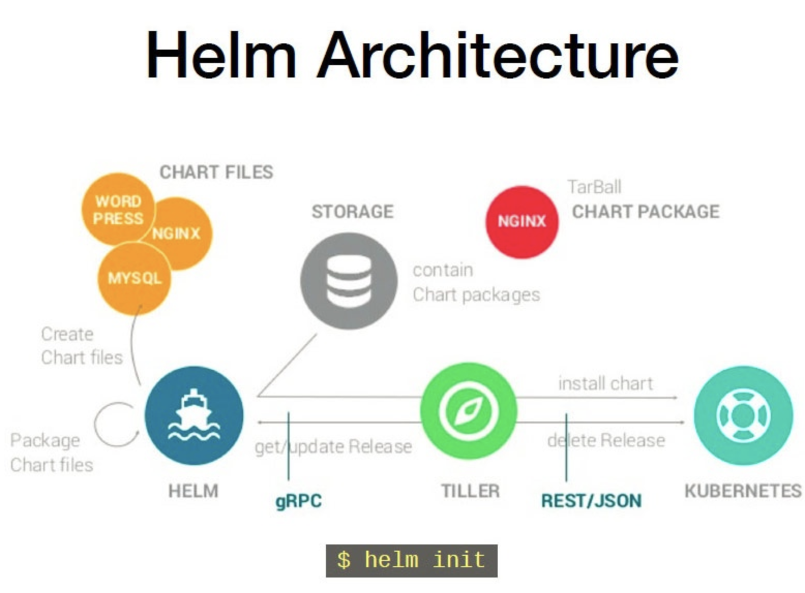

## Helm入门以及概念

### 1.概述

Helm是k8s的包管理工具，类似Linux系统常用的 apt、yum等包管理工具。

使用helm可以简化k8s应用部署

### 2.基本概念

- **Chart**：一个 Helm 包，其中包含了运行一个应用所需要的镜像、依赖和资源定义等，还可能包含 Kubernetes 集群中的服务定义，类似 Homebrew 中的 formula、APT 的 dpkg 或者 Yum 的 rpm 文件。
- **Release**：在 Kubernetes 集群上运行的 Chart 的一个实例。在同一个集群上，一个 Chart 可以安装很多次。每次安装都会创建一个新的 release。例如一个 MySQL Chart，如果想在服务器上运行两个数据库，就可以把这个 Chart 安装两次。每次安装都会生成自己的 Release，会有自己的 Release 名称。
- **Repository**：用于发布和存储 Chart 的存储库。

### 3.架构

- **Chart Install 过程：**
  - Helm从指定的目录或者tgz文件中解析出Chart结构信息
  - Helm将指定的Chart结构和Values信息通过gRPC传递给Tiller
  - Tiller根据Chart和Values生成一个Release
  - Tiller将Release发送给Kubernetes运行。
- **Chart Update过程：**
  - Helm从指定的目录或者tgz文件中解析出Chart结构信息
  - Helm将要更新的Release的名称和Chart结构，Values信息传递给Tiller
  - Tiller生成Release并更新指定名称的Release的History
  - Tiller将Release发送给Kubernetes运行

### 4.安装helm

- 安装客户端（必选）：

  helm主要包括helm客户端和Tiller服务端两部分，Tiller部署在k8s集群中。

  [8-1.部署 Helm](../Kubernetes教程/8-1.部署 Helm.md)

- 安装服务端（可选）：

  使用helm init 命令，可以一键安装。

  **关于chart仓库（Repository），通过helm命令：helm serve 就可以启动仓库服务**

