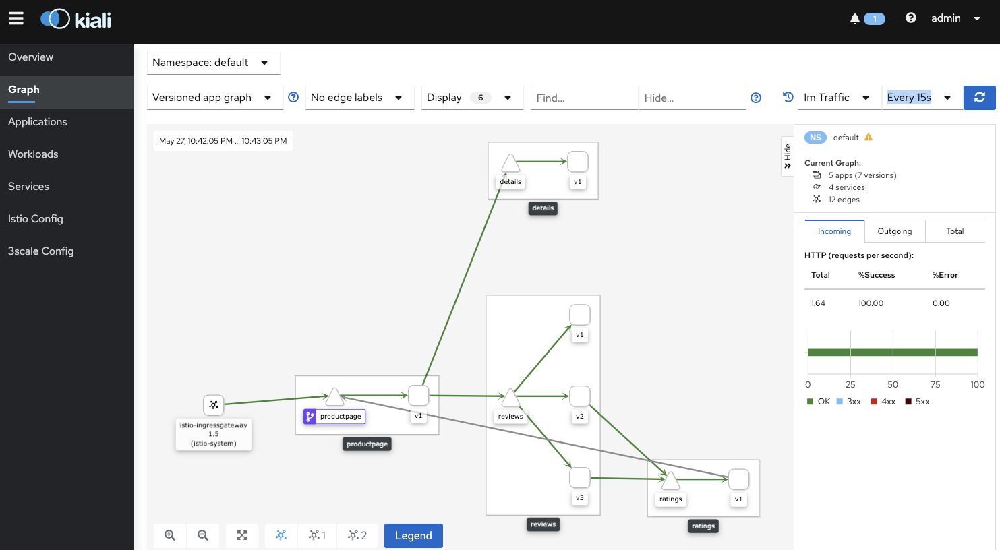

# 快速入门

### 安装Istio

```shell
$ istioctl install --set profile=demo
```

```shell
✔ Istio core installed
✔ Istiod installed
✔ Egress gateways installed
✔ Ingress gateways installed
✔ Addons installed
✔ Installation complete
```

为default命名空间添加istio-injection=enabled标签，开启自动 sidecar 注入

```shell
$ kubectl label namespace default istio-injection=enabled
```

```shell
namespace/default labeled
```

### 部署示例应用

```shell
$ kubectl apply -f samples/bookinfo/platform/kube/bookinfo.yaml
```

查看service与pod资源

```shell
$ kubectl apply -f samples/bookinfo/platform/kube/bookinfo.yaml
```

```shell
service/details created
serviceaccount/bookinfo-details created
deployment.apps/details-v1 created
service/ratings created
serviceaccount/bookinfo-ratings created
deployment.apps/ratings-v1 created
service/reviews created
serviceaccount/bookinfo-reviews created
deployment.apps/reviews-v1 created
deployment.apps/reviews-v2 created
deployment.apps/reviews-v3 created
service/productpage created
serviceaccount/bookinfo-productpage created
deployment.apps/productpage-v1 created
```

```shell
$ kubectl get services
```

```shell
[root@k8s-master01 networking]# kubectl get services
NAME          TYPE        CLUSTER-IP       EXTERNAL-IP   PORT(S)    AGE
details       ClusterIP   10.111.54.14     <none>        9080/TCP   5h4m
kubernetes    ClusterIP   10.96.0.1        <none>        443/TCP    23d
productpage   ClusterIP   10.101.241.99    <none>        9080/TCP   5h4m
ratings       ClusterIP   10.102.97.86     <none>        9080/TCP   5h4m
reviews       ClusterIP   10.108.164.236   <none>        9080/TCP   5h4m
```

```shell
$ kubectl get pods
```

```shell
[root@k8s-master01 networking]# kubectl get pods
NAME                              READY   STATUS    RESTARTS   AGE
details-v1-7f6df6f54-s4sl7        2/2     Running   6          4h41m
productpage-v1-69886c8bcb-jwlk6   2/2     Running   0          4h16m
ratings-v1-6665bbd4db-8lhw8       2/2     Running   6          5h5m
reviews-v1-7fd87d96bd-wfps4       2/2     Running   0          53m
reviews-v2-55d9bfb6d8-54rl5       2/2     Running   8          4h33m
reviews-v3-5776c54c64-lbzmt       2/2     Running   7          5h5m
```

确保所有的pod都ready之后进行下一步

验证部署是否成功

```shell
$ kubectl exec -it $(kubectl get pod -l app=ratings -o jsonpath='{.items[0].metadata.name}') -c ratings -- curl productpage:9080/productpage | grep -o "<title>.*</title>"
```

```shell
[root@k8s-master01 networking]# kubectl exec -it $(kubectl get pod -l app=ratings -o jsonpath='{.items[0].metadata.name}') -c ratings -- curl productpage:9080/productpage | grep -o "<title>.*</title>"
<title>Simple Bookstore App</title>
                                   [root@k8s-master01 networking]# 
```

### 对外暴露应用

应用部署成功之后还无法从外部访问，需要创建[Istio Ingress Gateway](https://links.jianshu.com/go?to=https%3A%2F%2Fistio.io%2Fdocs%2Fconcepts%2Ftraffic-management%2F%23gateways)来对外暴露应用。[Istio Ingress Gateway](https://links.jianshu.com/go?to=https%3A%2F%2Fistio.io%2Fdocs%2Fconcepts%2Ftraffic-management%2F%23gateways)在网格边缘进行路径映射。

1.将应用与Istio gateway联合：

```shell
$ kubectl apply -f samples/bookinfo/networking/bookinfo-gateway.yaml
```

```shell
gateway.networking.istio.io/bookinfo-gateway created
virtualservice.networking.istio.io/bookinfo created
```

```shell
$ istioctl analyze
```

```shell
✔ No validation issues found when analyzing namespace: default.
```


2.确认gateway已经创建成功：

```shell
$ kubectl get gateway
```

```shell
[root@k8s-master01 networking]# kubectl get gateway
NAME               AGE
bookinfo-gateway   30m
```

3.查看示例ip地址和端口

```shell
$ export INGRESS_PORT=$(kubectl -n istio-system get service istio-ingressgateway -o jsonpath='{.spec.ports[?(@.name=="http2")].nodePort}')
```

```shell
$ export SECURE_INGRESS_PORT=$(kubectl -n istio-system get service istio-ingressgateway -o jsonpath='{.spec.ports[?(@.name=="https")].nodePort}')
```

```shell
$ echo $INGRESS_PORT
```

```shell
[root@k8s-master01 networking]#  echo $INGRESS_PORT
30724
```

```shell
$ echo $SECURE_INGRESS_PORT
```

```shell
[root@k8s-master01 networking]# echo $SECURE_INGRESS_PORT
30302
```

查看ingress地址，没配置为空，可以通过宿主机地址做ip

```shell
$ echo $INGRESS_HOST
```

查看ingress端口号

```shell
$ echo $GATEWAY_URL
```

```shell
[root@k8s-master01 networking]# echo $GATEWAY_URL
:30724
```

4.通过浏览器访问 http://192.168.33.10:30724/productpage


### 查看Istio kiali 可视化dashboard

Istio的demo配置档案包含多种可选的dashboard，其中kiali dashboard可以通过呈现网格拓扑信息来帮助你了解服务网格的结构。

- 创建对应资源

  ```yaml
  apiVersion: networking.istio.io/v1alpha3
  kind: Gateway
  metadata:
    name: kiali-gateway
    namespace: istio-system
  spec:
    selector:
      istio: ingressgateway # use Istio default gateway implementation
    servers:
    - port:
        number: 80
        name: http
        protocol: HTTP
      hosts:
      - "*"   # 可以配置域名kiali.lswzw.com
  ---
  apiVersion: networking.istio.io/v1alpha3
  kind: VirtualService
  metadata:
    name: kiali-gateway
    namespace: istio-system 
  spec:
    gateways:
    - kiali-gateway
    hosts:
    - "*"     # 可以配置域名kiali.lswzw.com
    http:
    - route:
      - destination:
          host: kiali
          port:
            number: 20001
  ```

- 创建ingressgateway

  ```shell
  $ kubectl create -f kiali-gateway.yaml 
  ```

  ```shell
  [root@k8s-master01 networking]# kubectl create -f kiali-gateway.yaml 
  gateway.networking.istio.io/kiali-gateway created
  virtualservice.networking.istio.io/kiali-gateway created
  ```

- 访问地址http://192.168.33.10:30724/kiali

  ```shell
  账号：admin
  密码：admin
  ```

  访问http://192.168.33.10:30724/productpage可以观察到kiali呈现出了示例应用Bookinfo服务间的关系。

  


### 卸载

删除实例应用

```shell
$ samples/bookinfo/platform/kube/cleanup.sh
```


删除ingressgateway

```shell
$ kubectl delete -f samples/bookinfo/networking/bookinfo-gateway.yaml
```

```shell
$ kubectl delete -f kiali-gateway.yaml 
```


卸载 Istio

```shell
$ istioctl manifest generate --set profile=demo | kubectl delete -f -
```


